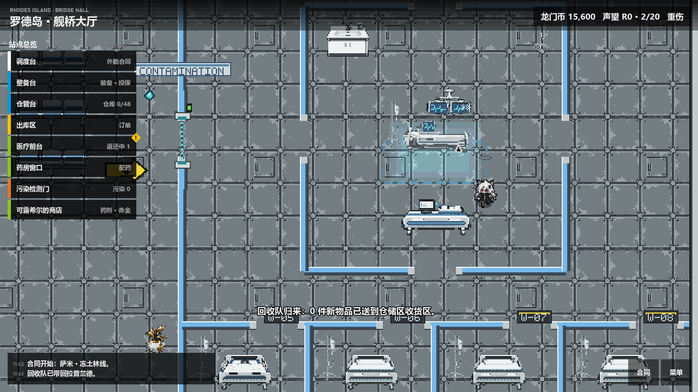
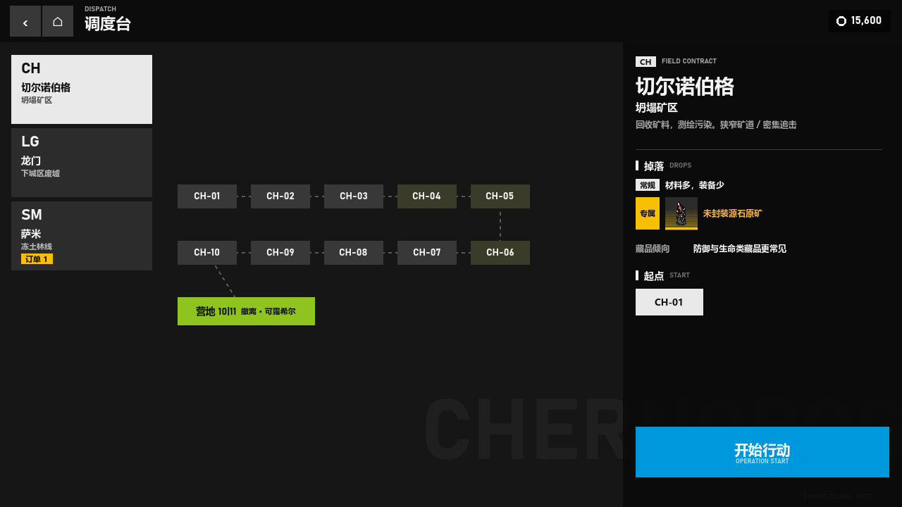
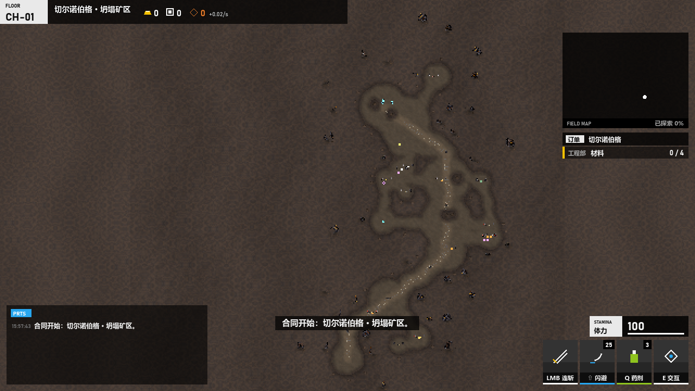
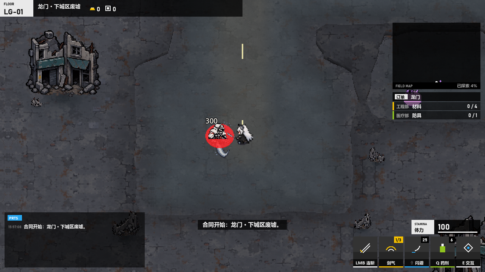
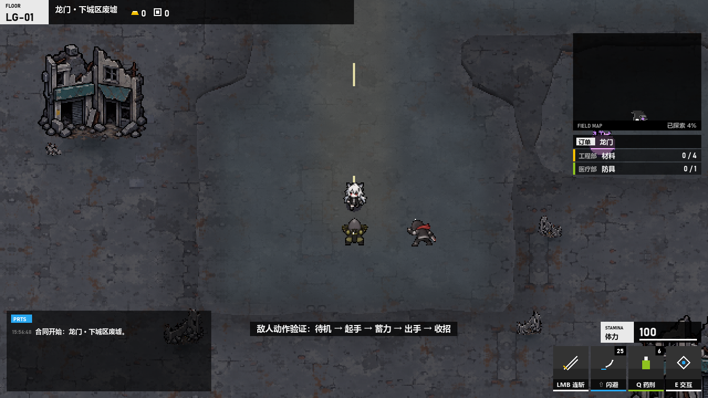
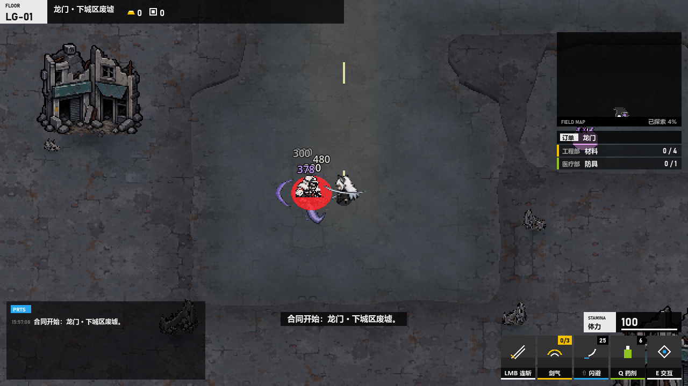
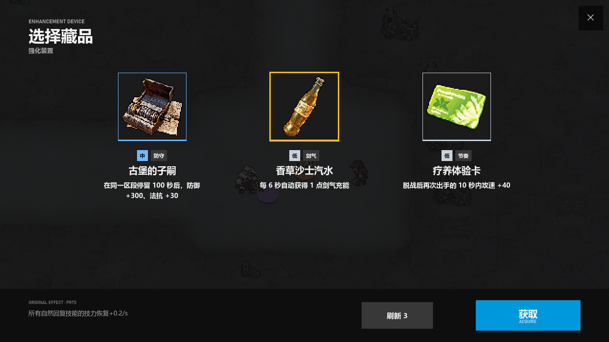
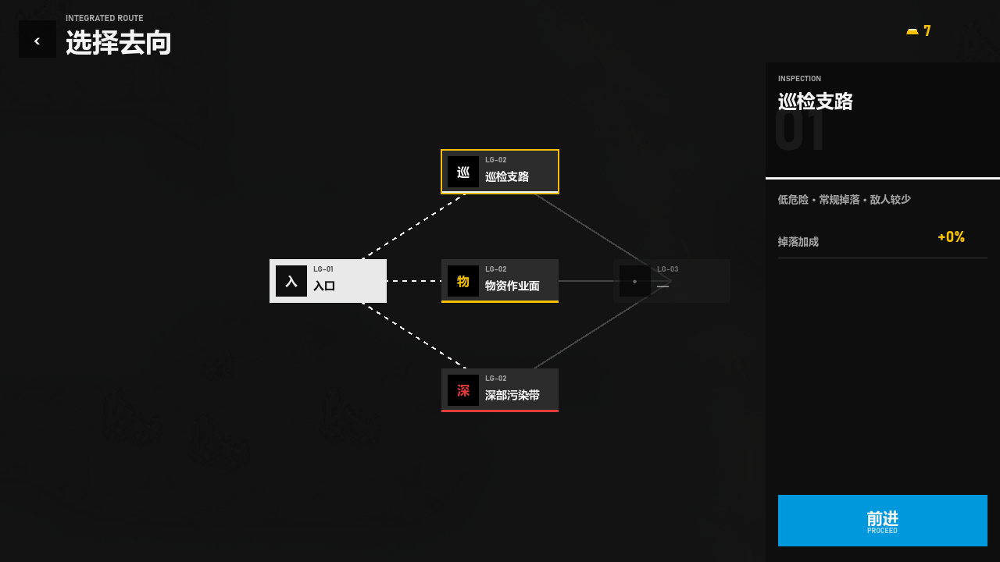
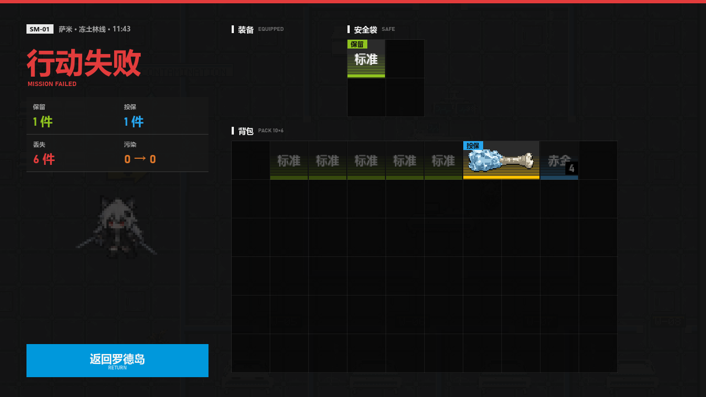
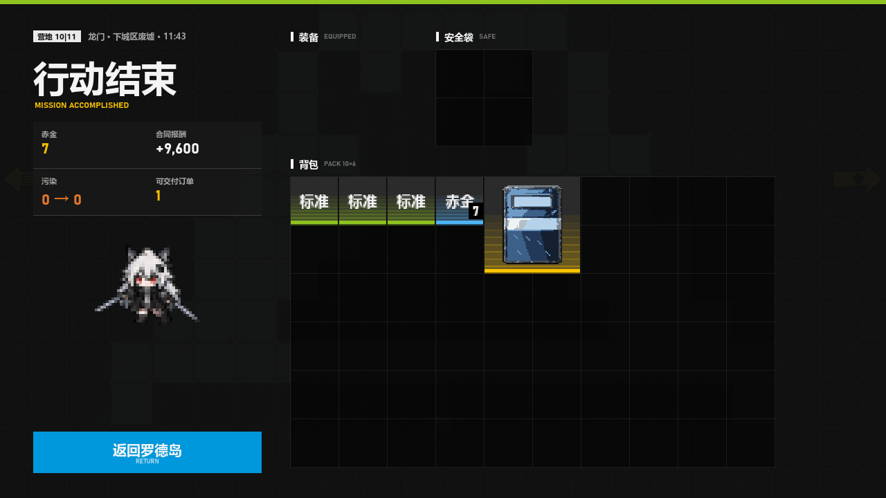

# STORYBOARD.md — Downfall (Assignment 2 summary)

> **Retrospective.** These panels are existing in-engine captures from `../evidence/`,
> taken by the test and capture scripts on 2026-10-06/07. They are **not** sketches
> drawn before generation.

**Frame shape:** 16:9 throughout (1280×720 window; the 3D world renders at 640×360).

**Shot vocabulary:**

| Shot | Description |
|---|---|
| Gameplay camera | Orthographic Camera3D, size 24, offset (0, 16, −10). That is a **high angle**, about 58° down, at **medium** framing. |
| Overview captures | A **bird's-eye wide** view used for design checks (`tests/capture_terrain.gd`). |
| Base and menu screens | **Flat / eye-level** UI views. |

**What's missing:** there is no low angle, over-the-shoulder or Dutch shot.

**Music (added 2026-10-07):** MUS-BASE in the base (panels 1, 2, 9), MUS-MINE in the
field (panels 3–7), STING-FAIL / STING-EXTRACT at the end of a run (panels 8, 10).
Behavior is predicted in CHANGE-BRIEF.md and checked by `tests/test_audio.gd`.

## Panel 1 — First sight: Rhodes bridge hall

- **Shot:** wide · flat eye-level · gameplay view (base screen)
- **Player action:** wakes from the title screen and walks Lappland to a station. The game highlights the station list on the left.
- **See:**
  - Lappland idle in the pixel ship interior;
  - station list, LMD/reputation bar and PRTS log.
- **Hear:** no event sound · MUS-BASE (pause menu: ducked 10 dB)
- **Assets:** CHAR-WALK, ENV-RHODES (`art/rhodes_runtime`)
- **Design reason ("region choice is an informed decision"):** home is a safe, readable hub, and every outing starts from here.

## Panel 2 — Choosing the contract

- **Shot:** close-up on UI · flat · design/menu view
- **Player action:** picks a region and a start point at the dispatch console, then presses 开始行动 (Start operation).
- **See:** the region list, a floor node strip with floors 4–6 marked, and the camp node.
- **Hear:** no event sound · MUS-BASE (pause menu: ducked 10 dB)
- **Assets:** UI only
- **Design reason ("informed decision"):** risk and reward are visible before committing.

## Panel 3 — Establishing the field (design view)

- **Shot:** wide · bird's-eye · **design view** (capture-only overview, not the player camera)
- **Player action:** none. This is a layout check of the main path, choke points and side rooms.
- **See:**
  - the mine surface (ENV-SURF-MINE) and prop groups (ENV-PROPS);
  - the continuous road outline.
- **Hear:** —
- **Assets:** ENV-SURF-MINE, ENV-PROPS
- **Design reason ("regions are perceivable"):** each region has its own surface and props, which share one terrain outline.

## Panel 4 — Core action: dual-blade combo

- **Shot:** medium · high angle · gameplay view
- **Player action:** left-clicks an enemy. The game plays combo stage 1, 2 or 3 and spawns the slash VFX.
- **See:** the CHAR-ATK1 pose, slash VFX, damage numbers and enemy health bar.
- **Hear:** SFX-HIT (synthesized, 170 Hz) on every swing · MUS-MINE (pause menu: the loop pauses in place)
- **Assets:** CHAR-ATK1..3, VFX-SLASH, ENV-SURF-CITY, SFX-HIT
- **Design reason ("positioning and timing"):** the attack has to feel committed and read clearly from its pose.

## Panel 5 — Reading the enemy

- **Shot:** medium · high angle · gameplay view
- **Player action:** sees the glint frame and dodges with Shift (CHAR-DASH, blue tint, 0.28 s invulnerable).
- **See:** the enemy's glint/telegraph pose and the dodge afterimage.
- **Hear:** SFX-ENEMY-<type>, 0.1 s before the wind-up ends · MUS-MINE (pause menu: the loop pauses in place)
- **Assets:** ENEMY-ATK atlas, SFX-ENEMY-*, CHAR-DASH
- **Design reason ("reading attacks comes first"):** the threat must be readable from motion and sound, without a ground circle.

## Panel 6 — Success: sword wave and relic pick

 

- **Shot:** medium · high angle · gameplay view, then close-up on the relic cards (UI)
- **Player action:**
  - three hits fill the charge;
  - the next swing releases a piercing wave;
  - at a boost device the player picks one of three relics.
- **See:** the CHAR-WAVE pose and wave VFX, then three relic cards at 144 px.
- **Hear:** SFX-CHARGE once when the charge fills, then SFX-BUILD on the pick · MUS-MINE (pause menu: the loop pauses in place)
- **Assets:** CHAR-WAVE, VFX-WAVE, RELIC-ICONS, SFX-CHARGE, SFX-BUILD
- **Design reason ("growth from this run's build"):** power comes from what you found this run.

## Panel 7 — Choosing the next descent

- **Shot:** close-up on UI · flat · gameplay view (combat paused)
- **Player action:** picks one of three routes. The game raises hidden danger by −3, 0 or +5.
- **See:** route nodes with danger colours.
- **Hear:** none · MUS-MINE (pause menu: the loop pauses in place)
- **Assets:** UI only
- **Design reason ("every descent is a trade-off"):** there is no single safe answer.

## Panel 8 — Failure: killed in action

- **Shot:** close-up on UI · flat · gameplay view
- **Player action:** HP reaches 0. The game calls `settle(false)` and shows 阵亡 (killed in action).
- **See:** kept, insured and lost items with distinct outlines; lost items are dimmed.
- **Hear:** SFX-HURT on the lethal hit · MUS-MINE fades out in 0.3 s, STING-FAIL plays once (`_settled` guard); MUS-BASE waits for it
- **Assets:** SFX-HURT, STING-FAIL, ITEM-ICONS
- **Design reason ("every descent is a trade-off"):** the player sees exactly what greed cost them.
- **Gap:** there is no death pose. The sprite simply stops.

## Panel 9 — Recovery and retry

- **Shot:** wide · flat · gameplay view (same base screen as Panel 1; no separate recovery-ward capture exists)
- **Player action:** wakes in the base, collects returned items at the depot and redeploys from dispatch.
- **See:** the base, and the PRTS log line 回收队已带回拉普兰德 ("the recovery team brought Lappland back").
- **Hear:** MUS-BASE from its start once the sting ends. Walking into the warehouse to the returned crates: SFX-LIGHTS-ON once per bank (4), the hatches and racks (SFX-HATCH / SFX-SHELF, files not generated yet), SFX-LIGHTS-OFF once on the way out
- **Assets:** ENV-RHODES, MUS-BASE, SFX-LIGHTS-ON, SFX-LIGHTS-OFF
- **Design reason:** failure costs loot, never the ability to try again.

## Panel 10 — End of a session: successful extraction

- **Shot:** close-up on UI · flat · gameplay view
- **Player action:** steps on the extraction point. The game settles with `settle(true)`, credits the reward and saves.
- **See:** the run summary and contract reward.
- **Hear:** MUS-MINE fades out in 1.0 s, STING-EXTRACT plays once; then MUS-BASE
- **Assets:** STING-EXTRACT, ITEM-ICONS
- **Design reason:** the run is closed out and the gains are visible.

## Coverage check against the assignment

| Requirement | Status |
|---|---|
| ≥6 panels | 10 panels |
| ≥3 views | wide, medium, close-up |
| ≥3 angles | high angle, bird's-eye, flat eye-level (UI) |
| Sketches before generation | **Not met.** Panels are post-hoc engine captures. |
| Music state per panel | Met: every panel names its track or sting (2026-10-07). |
