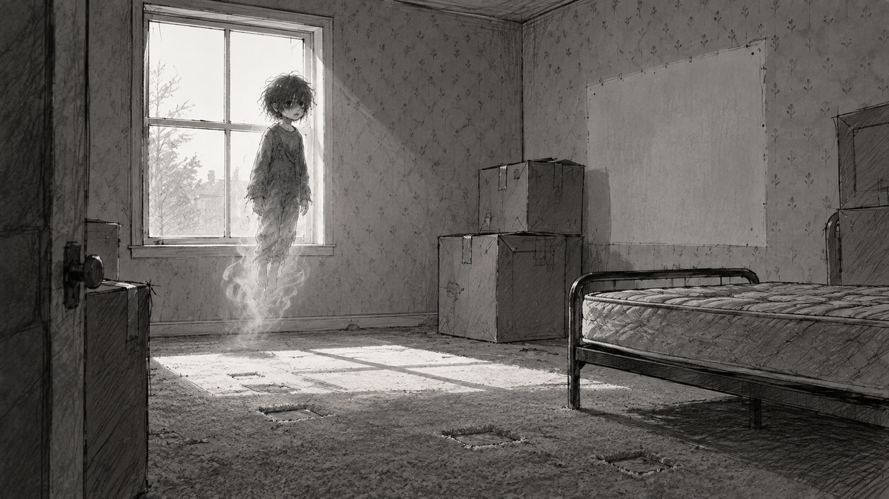
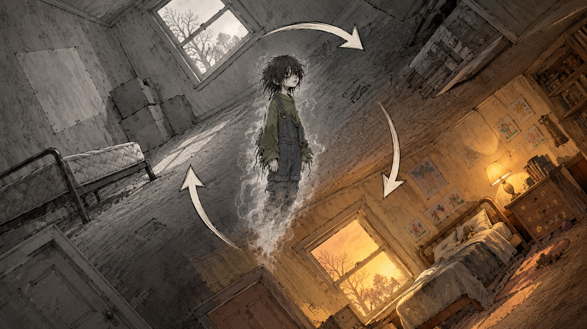
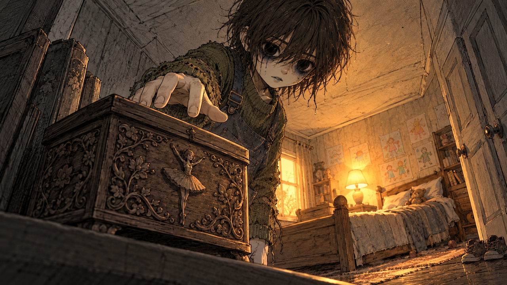
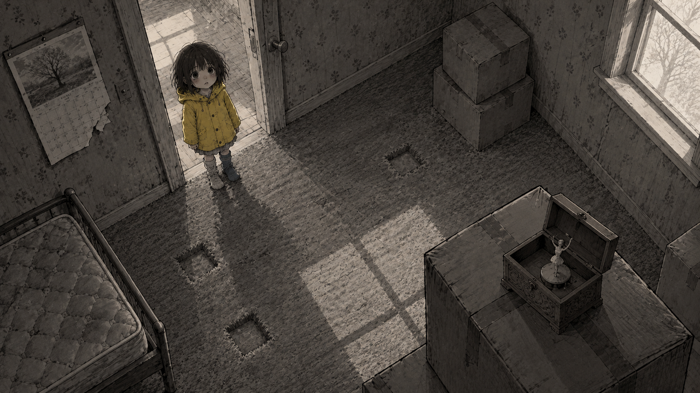
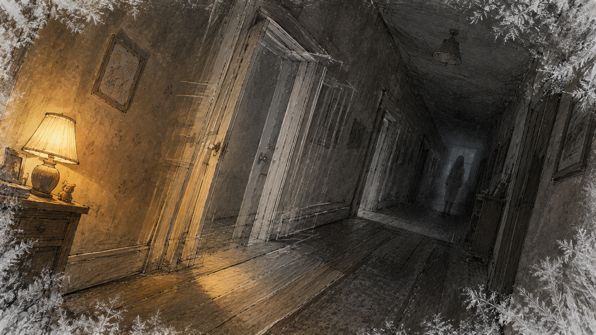
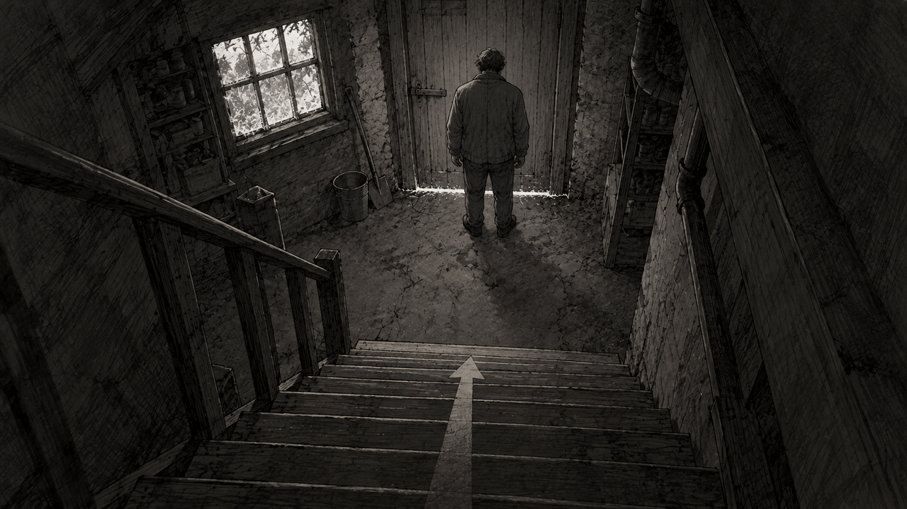

# HOUSEGHOST — Storyboard (Night 1 slice)

Frame shape: 16:9 throughout. Sketches live in `design/storyboard/` (01–06).
Views used: wide, medium, close-up. Angles used: eye level, low angle, high angle, Dutch tilt. Motion arrows appear on panels 2, 5, 6 where they clarify the beat — kept by choice; optional per the 2026-10-02 assignment update.

**Revision 2026-10-06 — the room.** Panels 1–4 were written for the living room and now take place in **his own bedroom**, which is what the slice builds. The bedroom is the stronger choice: it is his, the upright version has been stripped for the new family while the remembered version is intact, and the two generated backgrounds share a window, door, bulb and floor line so the flip reads as one room. Panels 5 and 6 (hallway, cellar door) remain semester work beyond the slice.

## Panel 1 — Moving day

- Shot: wide · eye level · gameplay view (the game camera's normal framing)
- Player action: first control — drifting through his old bedroom, now stripped: a bare mattress on a metal frame, taped moving boxes, a pale rectangle on the wallpaper where something used to stand
- See: the ghost pale and translucent, legs dissolving into mist, drifting slightly above the carpet; flat grey daylight through a curtainless window; dents in the carpet where furniture stood
- Hear: near-silence — house settling, a clock, muffled voices through the wall; no music
- Assets: CHAR-GHOST, ENV-ROOM-EMPTY
- Design reason (pillar: the house is a witness): establish the quiet world and that the player is the intruder in his own room — the space says a child was removed, not that a child lived

## Panel 2 — The flip

- Shot: medium · eye level rolling to inverted · gameplay view · motion: 180° camera roll arrows, ghost silhouette held center through the turn
- Player action: presses the invert key; the room rotates around the ghost
- See: mid-rotation, both rooms half-visible — the stripped bedroom becoming the lamplit one, the same window and door turning through the same positions; the ghost gaining solidity and warm colour through the turn
- Hear: SFX-FLIP (held breath, reversed room-tone swell); the lullaby fades in as the roll completes
- Assets: CHAR-GHOST, CHAR-REMEMBERED, ENV-ROOM-EMPTY, ENV-ROOM-MEMORY, SFX-FLIP, MUS-LULLABY
- Design reason (pillar: the flip is the fear): the transition itself is the signature image and the scariest beat — crossing a threshold, not pressing a button

## Panel 3 — The music box

- Shot: close-up · low angle (floor-level, looking up past the music box at the ghost reaching) · gameplay view
- Player action: in the remembered bedroom, finds the music box on its shelf where it always was and chooses the kind contact
- See: the ghost solid and warm, hand over the box; his room as it was — bed made, his crayon drawings taped on the wall exactly where the pale rectangle is in the stripped version, his shoes still by the door
- Hear: the lullaby quiets; a single mechanical click as the contact arms
- Assets: CHAR-REMEMBERED, PROP-MUSICBOX, ENV-ROOM-MEMORY
- Design reason (pillar: being seen costs): the choice moment — the player hovers between kind and scary, and the game holds its breath with them

## Panel 4 — She looks up

- Shot: medium · high angle (from the ghost's inverted position, looking down at the child) · gameplay view
- Player action: contact lands — flip back upright to watch the result
- See: in the stripped bedroom, the music box is playing by itself on top of a sealed moving box; the child in the doorway in her yellow raincoat, looking straight up at where the ghost is; a calendar page mid-tear in the corner of frame
- Hear: SFX-CONTACT (the music-box chime with the paper-tear inside it); the child's small gasp; silence after
- Assets: CHAR-GHOST, CHAR-CHILD-LOOKUP, PROP-MUSICBOX, PROP-CALENDAR, SFX-CONTACT, ENV-ROOM-EMPTY
- Design reason (pillar: being seen costs the truth's arrival): the game's first success and first cost in the same two seconds — recognition went up, a day went away

## Panel 5 — The hallway is wrong

- Shot: medium · Dutch tilt · gameplay view · motion: the far door frame shudders and drags into a new position (motion lines), frost crawls inward from frame edges
- Player action: failure/scare beat — exploring the memory-hallway, the player approaches a door their memory insists on; the room corrects itself
- See: the hallway mid-correction — a door where there wasn't one; at the far end, for under a second, the Hollow, off-center, not facing us
- Hear: SFX-CORRECT (wood groan under a de-tuned lullaby note); SFX-FROST creeping at the edges
- Assets: ENV-HALL-MEMORY, ENV-HALL-CORRECTED, CHAR-HOLLOW-GLIMPSE, SFX-CORRECT, SFX-FROST
- Design reason (pillar: nothing shown, everything implied): the first proof the memory-house lies — the player's safe world betrays them, and retreat (flip upright) becomes the recovery move

## Panel 6 — The cellar door

- Shot: wide · high angle (top of the stairs, looking down) · design view (session-end vignette, framed like gameplay but control is released) · motion: slow camera push toward the door (noted arrow)
- Player action: none — the night ends; the player has retreated upright, recognition meter up one notch, calendar down one day
- See: the father, back to camera, standing at the closed cellar door; a line of salt across its threshold; frost on the window beside him
- Hear: silence, the clock, one unexplained creak; no music
- Assets: CHAR-FATHER-BACK, ENV-CELLAR-DOOR, PROP-CALENDAR, SFX-FROST
- Design reason (pillar: nothing shown): end the session on the question the whole game is built on — why does he check a door nothing has touched?
