# TEST REPORT — HOUSEGHOST, Night 1 slice

**Engine:** Godot 4.7.2.stable.official.ed1daf0bf · **Platform:** macOS 26.x, Apple Silicon
**Source revision:** see the final commit on branch `narasimhaReddyValam`
**Project path:** `fall-2026/narasimha-v/assignment-2/walker-houseghost-narasimha-v/godot`

---

## 1. Startup and controls

Run from a clean checkout with:

```bash
godot --path godot
```

**Run it from a terminal rather than from the editor.** Godot keeps an open scene in memory, so an editor left running while the files change will play an older build. A terminal launch is also how a grader will run it.

**The fresh copy is the only honest version of this check.** Running from the working directory proves nothing about what a grader receives, because the working directory holds files the repository excludes. Cloning the pushed branch into a scratch directory and running it there caught a real fault the moment it was first tried: converting the audio to Ogg had left thirteen `.wav.import` stubs tracked in git, describing WAV files the course rule keeps out of the repository. On this machine the masters are still on disk so nothing complained; from a clean clone Godot reported three load failures. The automated suite passed in both cases, because the game reads the Ogg files and the stale records belong to nothing it asks for. Removed in `70974a7`, re-verified from a second clean clone: no errors, 13 checks passing.

**A correction worth recording.** A repeated report of "the character will not move" was twice attributed to that stale editor, and that diagnosis was wrong. The real cause was a race between two tween `finished` signals in the opening sequence: awaiting one that has already fired waits forever, and which of the two fired first depended on frame timing. The same build therefore handed over control on one machine and froze on another. It was found by putting the four relevant values on screen and asking for a single screenshot, after four rounds of reasoning had not found it.

| Check | Result |
|---|---|
| Project opens on Godot 4.7.2 with no missing resources | **Pass, verified from a fresh clone** of the pushed branch, not from the working copy: 39 art files, 11 effects, 2 music tracks and 6 storyboard panels all present, import clean, no load errors. This check first ran red — see below |
| Main scene loads and runs | Pass |
| Opening sequence plays and hands over control | Pass — each line waits for a key press, so the opening is read at the player's pace and cannot overrun |
| Read the story again (I) during play | Pass — holds the player still while open, returns control when closed |
| Move left and right | Pass |
| Jump | Pass |
| Flip the world | Pass |
| Contact a relic, tap and hold | Pass |
| Mute music (M) and effects (N) independently | Pass |
| Restart (R) | Pass |

## 2. The automated check

```bash
godot --headless --path godot --script tests/test_sound_triggers.gd
```

Twelve assertions, zero failures at the time of writing. It covers one sound per event under rapid repeats and held input, and the walking-versus-drifting contrast in both directions.

```
PASS  one flip produces exactly one flip sound
PASS  12 flip calls during a turn still produce one sound
PASS  two resolves inside the cooldown produce one contact sound
PASS  one frost sound per day torn
PASS  muted SFX still counts the event (state is unchanged by audio)
PASS  a held jump fires one jump sound
PASS  landing from that jump fires one land sound
PASS  walking in the memory produces footsteps
PASS  the ghost makes no real footsteps
PASS  but he keeps a rhythm of his own
PASS  the ghost displaces air while he moves
PASS  and the air stops when he stops
--- 12 checks, 0 failed ---
```

**What this check cannot do, stated plainly.** It verifies that an event fires exactly once and that muting changes no game state. It cannot hear, see, or understand. Every audio fault and every comprehension fault in this project was found by a person playing, while these assertions passed throughout.

It also cannot catch a timing race. Three runs of this check passed while a player could not move at all, because it drives input directly and never exercises the real frame timing of the opening sequence. Passing tests and a person who cannot play are not a contradiction; they are measuring different things. That is the single most useful thing this project taught about verification.

## 3. My own playtest

Played on 2026-10-07 from a terminal launch, with sound on and then with both music and effects muted.

| Check | Result |
|---|---|
| Plays through with sound on | Pass — movement, the flip, all three relics, the day cost, and the ending all behaved as designed |
| Plays through fully muted (M and N) | **Pass** — everything the slice communicates was still understandable with no audio at all |
| Music loop seam | **Pass.** Both tracks played past their wrap with no click or gap. This session is on the Ogg build, so the conversion is covered by it |
| Revised effects balance | **Pass.** The quieter footsteps sit under the story sounds and the mix reads as intended |

The muted result is the one that matters most here, because readability without sound is a scored criterion and the only honest way to establish it is to take the sound away and still be able to play. All four rows are a human result, not an engine one. The muted row matters most: readability without sound is a scored quality and the only honest way to establish it is to take the sound away and still be able to play.

## 4. Another person played it

A friend played the build without being told anything about the story or the controls. Her feedback, as reported to me:

> It's confusing. I didn't know what to do, or when to turn upside down, or why I was doing that.

This is recorded as given and was not solicited with leading questions. It is the most useful result in this report, because it isolates a failure I could not see: I already knew the story, so I could not tell that the game never conveyed it.

**What it exposed.** The slice had an opening that establishes *who the player is* — a boy who was erased, a family living in his house, a wish to be noticed — but nothing that teaches *what to do*. The central verb, turning the world over, was never taught at all. It appeared in a hint line at the bottom of the screen that listed every control at all times, which a player reads once and then stops seeing.

**What changed in response.**

- The permanent hint line is gone. In its place, a prompt appears beside the thing it refers to, only when it can be acted on, and stops appearing once it has been used.
- Arrow keys are shown until the player first moves.
- Standing below a relic that cannot be reached from the floor shows **F**, next to the relic itself.
- Once inverted and within reach, that becomes **E**.
- Once a relic has been taken, its prompt and its light both go out, so what remains lit is always what is left to do.

Verified in engine: before moving the cue reads the arrow keys; standing under the music box in the normal world it reads F; after flipping, in reach, it reads E; after the contact lands it fades out.

**Not yet retested with her.** The changes above are a response to her session, not a result she has confirmed. A second session with the same player, or a fresh one, is the honest next step and has not happened.

## 6. Storyboard against the slice

Each panel the slice covers, beside the same moment captured in engine.

| Storyboard panel | The same moment, in engine | Difference |
|---|---|---|
| **1 — Moving day**<br> | 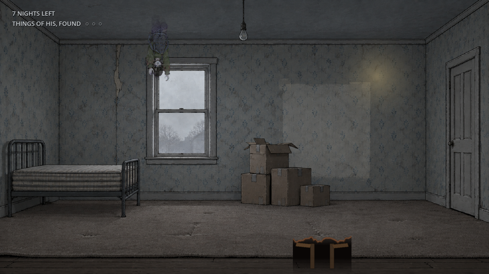 | The slice opens on the stripped room with the child already present, which the panel does not show. Strengthened deliberately: the first thing the player sees is the room emptied, not a title |
| **2 — The flip**<br> | 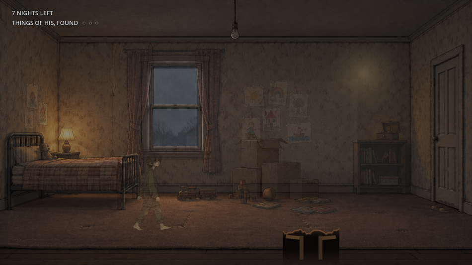 | The panel draws a 180° roll; the engine dissolves one room into the other while the camera stays level. The dissolve read far better in play and never disorients — recorded as a deliberate departure |
| **3 — The music box**<br> | 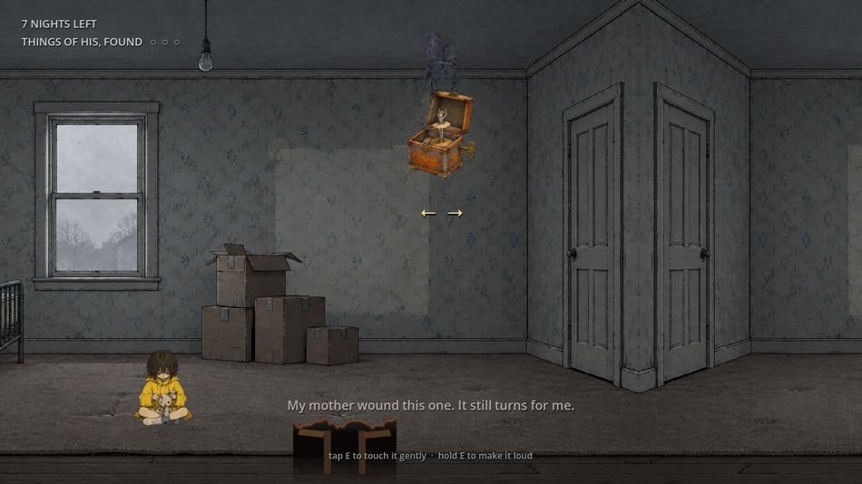 | Matches. The box sits on the bookshelf and is reachable only from the inverted side |
| **4 — She looks up**<br> | 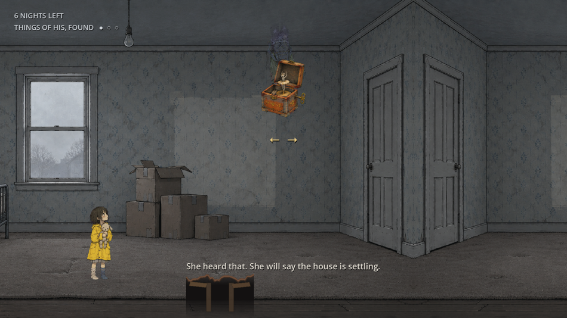 | Matches in substance: her posture changes toward the room. The panel frames her from a high angle; the game camera stays at eye level, because the slice never moves the camera |
| **5 — The hallway is wrong**<br> | *not covered* | Out of scope for the slice; semester work |
| **6 — The cellar door**<br> | *not covered* | Out of scope for the slice; semester work |

## 7. Character against the sheet

| Sheet element | In engine |
|---|---|
| Idle, remembered — solid, grounded | 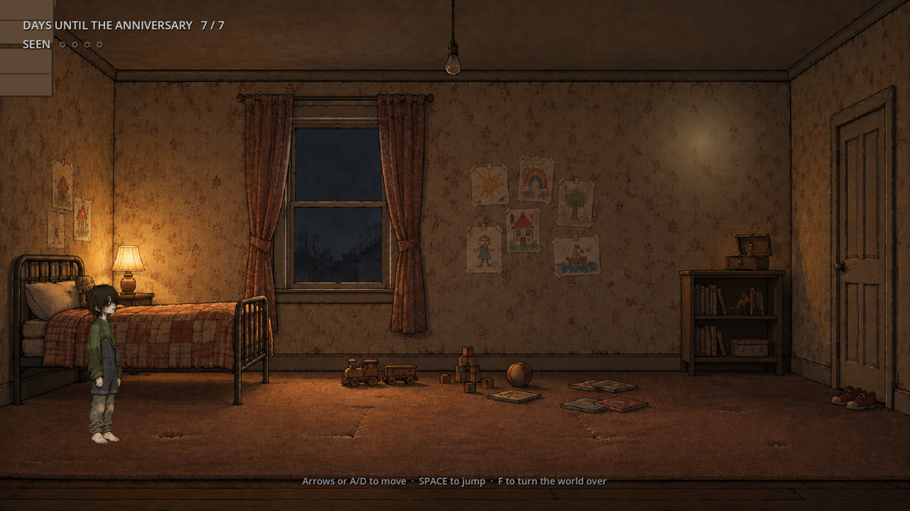 |
| Walk, remembered — the eight-frame cycle | 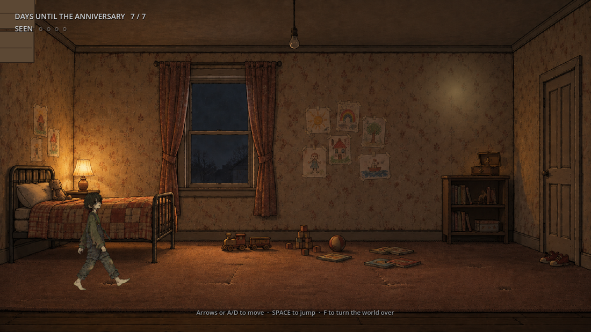 |
| Ghost, inverted — hanging from the ceiling | 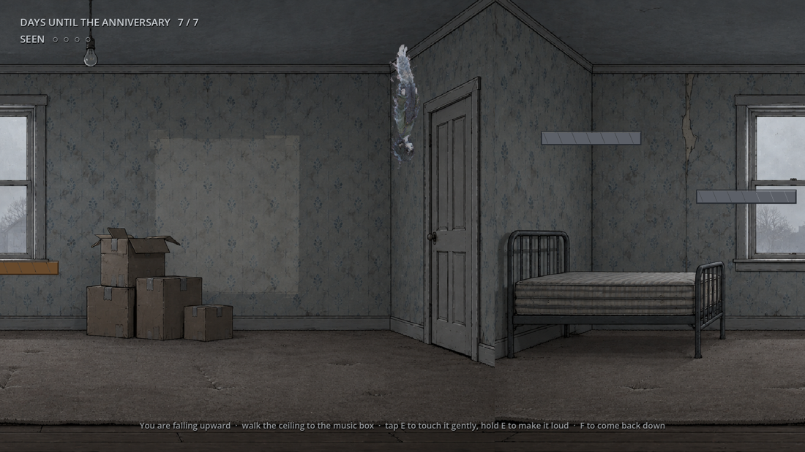 |
| Jump poses | 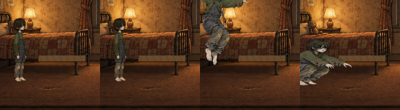 |
| One body size across every pose | 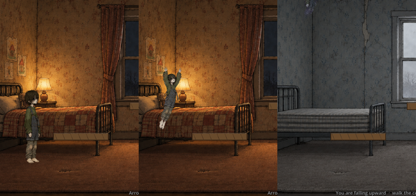 |
| Orientation follows input, left flipped at runtime | 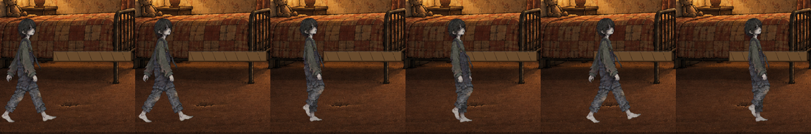 |
| Collision against the art | 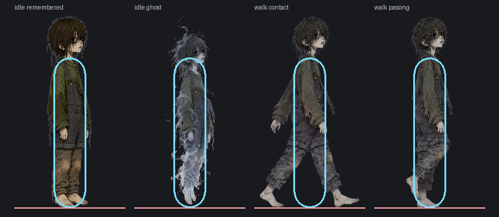 |

The size row is the one that took three attempts: height, shoulder width and head
width all failed across poses, and body area is what finally held. The screenshot
above is the check that settled it.

## 8. Sound

| Check | Result |
|---|---|
| Four events minimum, each firing once per occurrence | Pass — nine events, twelve assertions |
| Rapid repeats and held input do not double-fire | Pass |
| Music loops without an audible click | **Pass.** Verified two ways: in engine both tracks load as `AudioStreamOggVorbis`, 59.5 s and 61.9 s, with loop set in code because the importer defaults it to false; and by listening past the wrap on the Ogg build, where no click or gap is audible |
| Music behaviour on flip, failure, success and end | Pass — crossfade on the flip, long clean fade on either ending |
| Mute works for music and effects separately | Pass |
| Slice readable with all sound muted | **Pass, confirmed by a muted human playthrough** on 2026-10-07: played with both M and N muted, and everything the slice communicates was still legible. The visual carriers are the nights counter, the relic lights going out as each is answered, the contextual key cues, and the child's posture turning further toward the room |

## 9. Revision driven by observation

Several, all recorded in FRICTIONAL.md and CHANGE-BRIEF.md. The two most consequential:

**Sounds that fired and could not be heard.** Measurement showed `contact` audible for 19 % of its length, `correct` 15 %, `frost` 29 % — brief ticks surrounded by silence, lost under a score at full level. All were compressed to be dense rather than spiky (contact now 84 %, correct 77 %, flip 96 %) and the music now ducks 15 dB beneath each one. The automated check had passed the whole time.

**A level where nothing the player did mattered.** The floating platforms could be ignored entirely by walking on flat ground. They were removed and replaced with gaps in the floor that cost a night to fall through, and with obstacles that exist in only one world.

## 10. Honest limitations

- The three room tiles repeat; the middle one is mirrored to break the repetition, which puts two doors adjacent at the seam.
- The floor gaps exist in both worlds although the fiction says only the real house has been pulled apart.
- Three character-sheet poses are specified but not generated.
- The floorboard relic, the floor holes, the glow and the heartbeat are drawn or synthesised in code and satisfy no generative requirement; the asset log marks each as such.
- Storyboard panels 5 and 6 are not covered.
- A player who skips the opening can still take a few moments to work out what the game wants; the contextual cues are a response to that and have not been retested on a fresh player.
- Storyboard panel 2 reads closer to a diagonal division than a 180° roll.

## 11. The film

**The House Is a Witness.** — 3840x2160, in the [course media storage](https://northeastern-my.sharepoint.com/:f:/r/personal/valam_n_northeastern_edu/Documents/The%20House%20Is%20a%20Witness%20(Art%20%26%20Sound)?d=w4cd7a183ebfb445282e99594585c140b&csf=1&web=1&e=F2oHje),
identified by filename and SHA-256 in README.md and SUBMISSION.md.

The gameplay in it is a real engine capture, not a reconstruction: 32.63 s at native
4K, 1958 ticks at exactly 60 fps, driven by real key events against an isolated copy
with no teleporting and no seeded state, carrying the game's own audio. Every clip is
labelled on screen as a scripted-input capture, and the stretches that hold a final
frame say so. The capture's SHA-256 and the hash of every source file it displays are
in `youtube/claude-liam-houseghost-gamedev/`.
