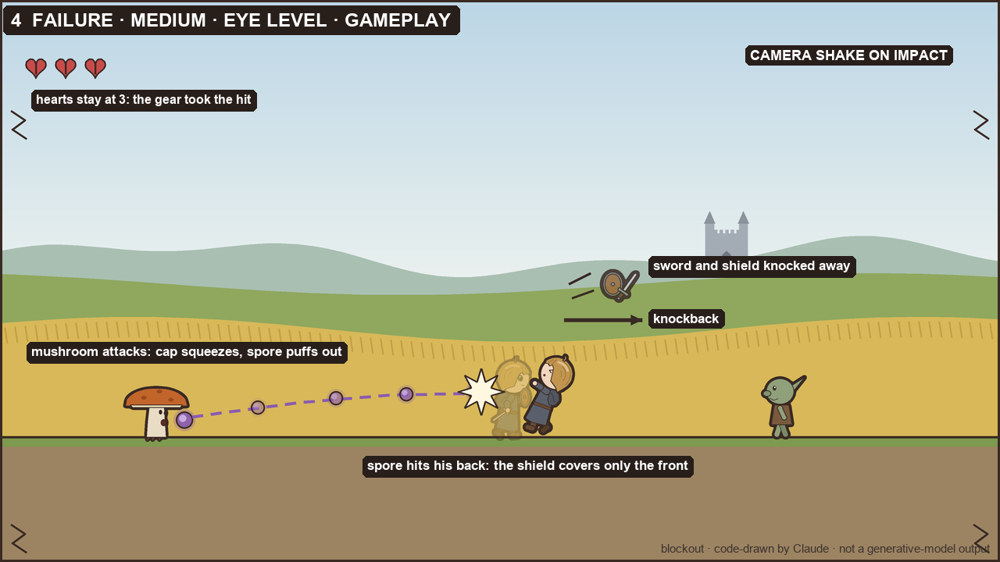
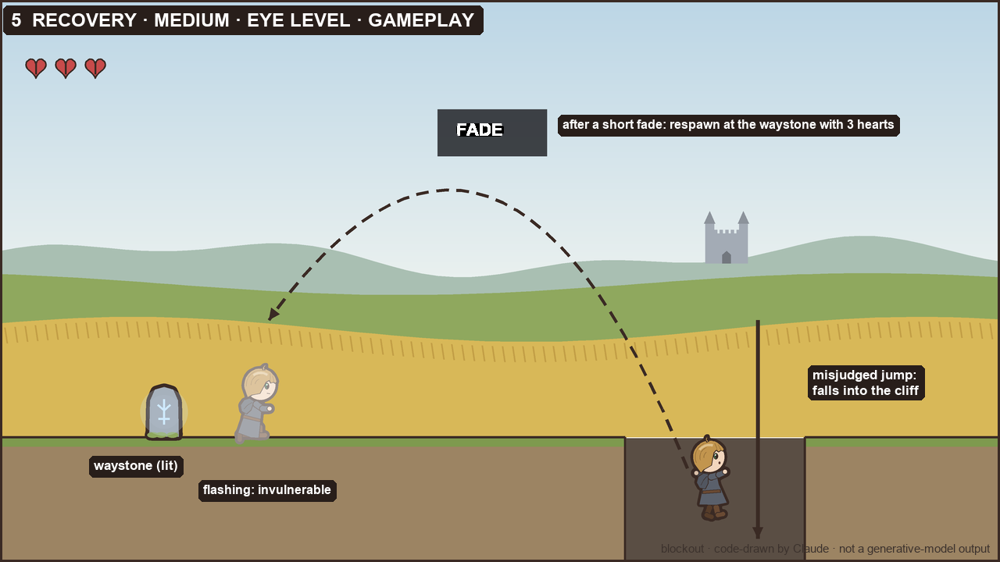
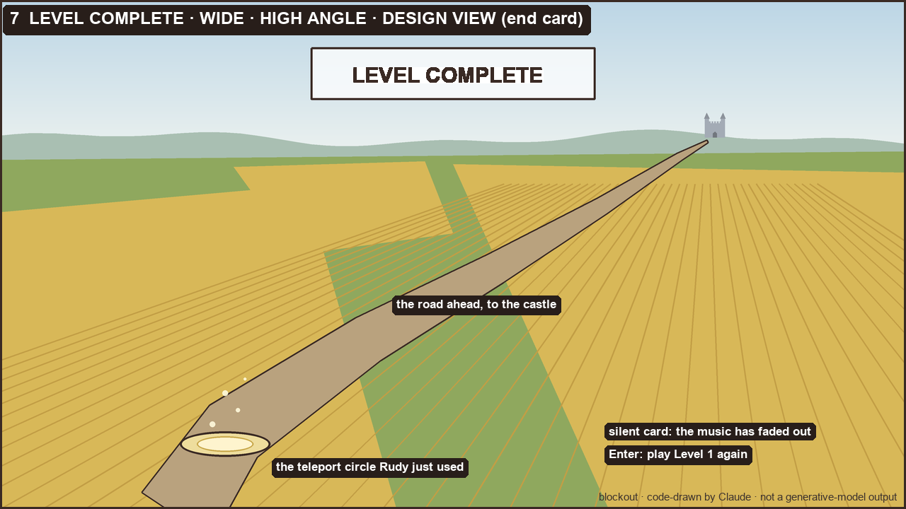

# STORYBOARD — walker-rudy

> Draft v3, 2026-10-01. Panels follow the assignment's template. Frame shape: 16:9 throughout. Gameplay panels show what the game camera shows, a 1920×1080 view that follows Rudy; design views are moments outside normal play, or shots that set how a moment should feel. Pictures are blockout thumbnails in `design/storyboard/`, drawn by code that Claude wrote (`design/tools/make_blockouts.py`). They are not generative-model outputs; I chose this route instead of hand sketches.

| Panel | Moment | View | Angle | Motion | Type |
|---|---|---|---|---|---|
| 1 | First sight: the title over the opening of play | medium | eye level | — (the title fades; play starts on the same screen) | gameplay |
| 2 | Core action: over the spikes, onto a goblin | medium | eye level | jump arc, stomp bounce, camera follows | gameplay |
| 3 | Success: the sword and shield | close-up | low | — | design view |
| 4 | Failure: a spore from behind | medium | eye level | spore path, knockback, gear flying off, camera shake | gameplay |
| 5 | Recovery: back at the waystone | medium | eye level | fall arrow, fade, respawn | gameplay |
| 6 | The end: the teleport circle | wide | eye level | run-in arrow, rising light, camera zooms out | gameplay, then transition |
| 7 | Level complete: the road to the castle | wide | high | — | design view (end card) |

Requirements check:
- **Three views:** wide (6, 7), medium (1, 2, 4, 5), close-up (3).
- **Three angles:** eye level (1, 2, 4, 5, 6), low (3), high (7).
- **Motion:** shown on panels 2, 4, 5 and 6.

## Panel 1 — First sight: the title over the opening of play

- **Shot:** medium · eye level · gameplay view (the opening of Level 1, with the title on top) · motion: none; the title fades out
- **Player action:** presses Enter; the title fades and play starts on the same screen, with no loading and no scene change
- **See:** the start of Level 1: Rudy idle on the path, golden wheat meeting green meadow, the castle small on the far horizon; the game title and "press Enter to start"; the hearts appear when play starts
- **Hear:** the theme starts softly under the title and keeps playing into play without restarting (music: playing)
- **Assets:** ENV-SKY-CASTLE, ENV-FIELDS, ENV-GROUND, CHAR-IDLE, UI-TITLE, UI-HEART, MUS-LOOP
- **Design reason (P4 — A journey into another world):** the very first frame is the world itself, and one key press puts the player in it

## Panel 2 — Core action: over the spikes, onto a goblin

- **Shot:** medium · eye level · gameplay view · motion: an arc arrow for Rudy's jump over the spikes, landing on the goblin's head; a short bounce arrow after the stomp; the camera follows Rudy sideways
- **Player action:** runs right, jumps the spikes and lands on a patrolling goblin; the goblin is squashed and vanishes, and Rudy bounces up a little
- **See:** the run, rising and falling poses; the goblin walking, then squashed; the spikes clearly visible on the ground
- **Hear:** the jump sound on takeoff (SFX-JUMP) and the stomp sound on contact (SFX-STOMP); music: playing
- **Assets:** CHAR-RUN-A, CHAR-RUN-B, CHAR-RISE, CHAR-FALL, ENEMY-GOBLIN, ENV-SPIKES, ENV-GROUND, ENV-FIELDS, SFX-JUMP, SFX-STOMP, MUS-LOOP
- **Design reason (P2 — Read every threat):** the spikes and the goblin's path are readable before the jump, so the player plans the move instead of guessing

## Panel 3 — Success: the sword and shield

- **Shot:** close-up · low angle · design view (how the pickup should feel; in play it happens in the medium gameplay shot) · motion: none
- **Player action:** touches the sword-and-shield pickup; Rudy switches to the sword form and the pickup disappears
- **See:** Rudy's hand closing on the sword hilt, the round shield on his other arm, a grin; the pickup's glow fading
- **Hear:** the pickup sound (SFX-PICKUP); music: playing
- **Assets:** PROP-SWORDSHIELD, CHAR-SWORD-IDLE, SFX-PICKUP, MUS-LOOP
- **Design reason (P1 — Your gear is your plan):** the player sees at once that Rudy's shape and his options have changed

## Panel 4 — Failure: a spore from behind

- **Shot:** medium · eye level · gameplay view · motion: the spore's path from the mushroom to Rudy's back; a knockback arrow; the sword and shield flying off and fading; a small camera shake on impact
- **Player action:** walks right with the shield raised toward a goblin. The mushroom monster behind him fires, and the spore hits his back, where the shield does not cover him. The game knocks the gear away (no heart is lost), Rudy flashes while invulnerable, and control returns after a short knockback.
- **See:** the mushroom in its attack pose and the spore in flight; Rudy's block pose, then his hurt pose as the gear flies off; the hearts still at 3
- **Hear:** the mushroom's attack sound (SFX-SPORE), then the hurt sound (SFX-HURT); music: dips briefly, then returns
- **Assets:** ENEMY-MUSHROOM, FX-SPORE, ENEMY-GOBLIN, CHAR-SWORD-BLOCK, CHAR-HURT, UI-HEART, SFX-SPORE, SFX-HURT, MUS-LOOP
- **Design reason (P3 — It stings, then you try again; also P2):** the player sees exactly what hit him and from where, and the cost (the gear) is visible but not crushing

## Panel 5 — Recovery: back at the waystone

- **Shot:** medium · eye level · gameplay view · motion: a fall arrow down a cliff gap; a fade; Rudy reappearing at the waystone, flashing
- **Player action:** misjudges a jump over a cliff and falls; it is instant death. After a short fade Rudy reappears at the last waystone with 3 hearts.
- **See:** the falling pose dropping out of the frame; the fade; the lit waystone; the respawn pose, flashing while invulnerable; the hearts refilled to 3
- **Hear:** the fall sound (SFX-FALL); music: dips during the respawn and carries on, without restarting
- **Assets:** CHAR-FALL, CHAR-RESPAWN, ENV-WAYSTONE, ENV-GROUND, UI-HEART, SFX-FALL, MUS-LOOP
- **Design reason (P3 — It stings, then you try again):** failure is quick and the way back is short, so the player wants one more try

## Panel 6 — The end: the teleport circle

- **Shot:** wide · eye level · gameplay view, ending in a transition · motion: Rudy runs into the circle (arrow); light rises from the circle; the camera zooms out slowly
- **Player action:** steps onto the teleport circle; input stops, Rudy celebrates, and the screen fades to the end card (panel 7)
- **See:** the celebrate pose, the glowing circle with rising light, the castle still on the horizon
- **Hear:** the arrival shimmer (SFX-PORTAL); music: fades out under it, then quiet on the end card
- **Assets:** CHAR-CELEBRATE, ENV-PORTAL, ENV-SKY-CASTLE, ENV-FIELDS, SFX-PORTAL, MUS-LOOP
- **Design reason (P4 — A journey into another world):** reaching the circle feels like arriving and setting off again, with the castle still ahead

## Panel 7 — Level complete: the road to the castle

- **Shot:** wide · high angle · design view (the end card) · motion: none
- **Player action:** none; the run is over and the card holds. Enter plays Level 1 again from the opening.
- **See:** "Level complete" over a high view of the countryside: the teleport circle Rudy just used, and the road winding from it across golden wheat and green meadow to the castle on the horizon
- **Hear:** nothing; the music has faded out, and the card is silent
- **Assets:** ENV-ENDCARD, UI-TITLE (the "Level complete" text)
- **Design reason (P4 — A journey into another world):** the session ends by showing how far the road still goes, so finishing a level feels like the start of the next stretch

## Revisions after design-v1

*Written on 2026-10-07 by Claude, from CHANGE-BRIEF.md's revisions and TEST-REPORT.md; no decision in it is new.*

The panels above are design v1 (tag `design-v1`, commit `5649d5b`) and stay as written, pictures included. Where they differ from the slice, these notes win. The slice beside each panel is in TEST-REPORT.md, [Storyboard against the slice](TEST-REPORT.md#3-storyboard-against-the-slice).

- **Panel 1:** UI-TITLE is text in the engine's default font, not a generated asset, so it has no row in ASSET-LOG.md. The panel has no sound event; the music is its only sound.
- **Panel 4:** the mushroom monster is cut (2026-10-04, cut-order step 4), so the spore from behind, the block pose and SFX-SPORE are not in the slice. ENEMY-MUSHROOM, FX-SPORE and SFX-SPORE were never generated; CHAR-SWORD-BLOCK was generated and is loaded, but nothing shows it. The failure comes from a goblin or the spikes instead: the hit knocks the gear away, as planned, and plays SFX-HURT with the music's short dip.
- **Panel 5:** a fall is no longer instant death with 3 hearts (2026-10-02). It costs one heart and sends Rudy back to the last waystone with the hearts he has left; when the last heart goes, by a hit or a fall, the level starts over from the opening. SFX-FALL is cut: a fall plays SFX-HURT.
- **Not on any panel:** the sword's slash (CHAR-SWORD-SLASH, SFX-SLASH) is in the slice but has no panel; CHANGE-BRIEF.md lists its panel as "—". CHAR-DEFEAT, which CHANGE-BRIEF.md maps to panels 5 and 6, shows when the last heart goes, a moment neither panel draws.
