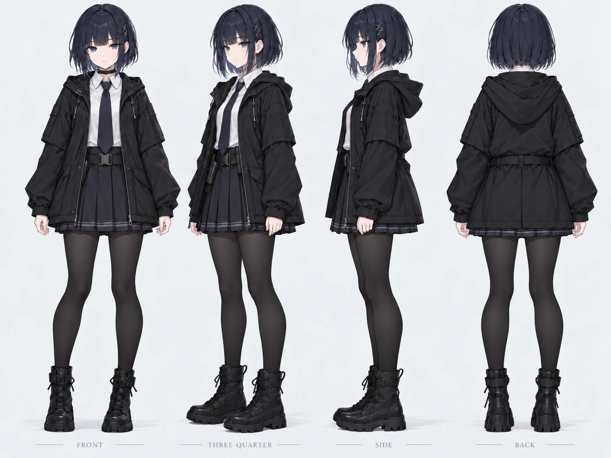

# Character sheet — Player character (name TBD)

> Version 1 — written 2026-10-03 to 2026-10-07. The design was worked out in a conversation with ChatGPT, where I described, judged, and revised each visual draft; this sheet records the decisions from that conversation. Later changes go in "Revision history" at the end; version 1 is not rewritten.
> Images are in `design/character/`. Rejected drafts are kept as thumbnails in `design/rejected/` and logged in `SOURCES.md`.

- **Concept in one sentence:** A dark-toned anime schoolgirl operative with a short navy-blue bob, an oversized matte black hooded coat, a pleated skirt, opaque black tights, combat boots, and a minimal tactical belt; body armor and other tactical equipment are separate modular items, not part of the base character.
- **Reference direction:** polished 2D anime character-design sheet / turnaround, subdued dark palette, matte cloth materials, no glossy "cheap AI" surfaces.
- **View:** third person over the shoulder (first person while aiming), as in `CONCEPT.md`.
- **Reference image:** `design/character/turnaround.png`
- **Silhouette image:** `design/character/silhouette.png` (to be made)
- **Collision overlay:** `design/character/collision.png` (to be made)

## Human design decisions

The character was defined through iteration that I directed; no generated image was accepted as-is. I made these decisions:

- Chose a dark anime school-tactical direction rather than a conventional military character.
- Chose short dark navy-blue hair with blunt bangs, keeping the hairstyle feminine while still clearly short.
- Chose a white school-style shirt, dark tie, pleated skirt, oversized hooded coat, and black combat boots as the permanent base outfit.
- Chose 80D+ matte opaque black tights, and explicitly rejected glossy, latex-like, PVC-like, wet-look, or plastic-looking materials after generated outputs kept producing unrealistic reflective clothing.
- Changed the coat construction so it hangs outside the skirt instead of looking tucked into it. Only the lower skirt hem should stay visible from the side and back.
- Removed unnecessary crosses, insignias, emblem graphics, and decorative motifs, so the character stays a clean base model rather than a heavily pre-authored faction design.
- First considered a thigh-mounted handgun holster, then rejected it because it conflicted visually and structurally with the skirt.
- Moved the handgun holster to the character's right waist / right hip.
- Hid the right-waist holster under the coat, so it is normally concealed and only shows when the coat lifts or opens.
- Decided that ballistic vests, chest rigs, medical pouches, magazine pouches, backpacks, tactical tablet pouches, and other mission equipment are not permanently attached to the base character.
- Defined armor and tactical equipment as modular assets, so the player can equip different items during play.
- Prioritized a clean front / three-quarter / side / back turnaround suitable for later 3D reconstruction over a highly detailed single illustration.
- Kept the tactical waist belt as part of the base outfit, because it supports later modular equipment while keeping a clean silhouette.

### Human / AI division of work
- **Me:** chose the visual direction, judged generated outputs, rejected incorrect materials and clothing construction, moved the holster, simplified decorative details, and decided which equipment is modular.
- **AI image generation** (ChatGPT image generation; ComfyUI with ChenkinNoob-XL locally — see `SOURCES.md`): produced the visual drafts used to test those choices.
- **ChatGPT (text):** helped turn my design decisions into prompts, consistency rules, and production notes.
- **Claude Code:** merged that material with my storyboard and concept (subway-base slice, tablet poses, asset IDs), organized the images, and wrote the asset log.
- **Final authority:** I accept, reject, or revise every generated output.

## 1. Base character specification

### Head and hair
- Short dark navy-blue bob.
- Chin-length or slightly shorter at the back.
- Straight blunt bangs.
- Feminine silhouette despite the short cut.
- Soft face-framing side locks.
- Cool blue-gray eyes.
- Calm, reserved expression by default.

### Base clothing
- White collared shirt.
- Dark necktie.
- Oversized matte black / charcoal hooded outer coat.
- The coat hangs outside the skirt and covers most of it from the back and sides.
- Only the lower edge of the pleated skirt stays visible beneath the coat.
- Dark pleated school-style skirt.
- Thick matte black opaque tights (80D+ look).
- Black ankle / mid-ankle combat boots with a practical silhouette.
- Tactical waist belt, kept as part of the base outfit.

### Holster
- One handgun holster on the character's right waist / right hip.
- The holster is under the coat and is normally mostly hidden.
- It shows only when the coat lifts or opens.
- No thigh holster.

### Modular equipment rule
These are not part of the base character and are modeled or generated separately:
- Plate carriers / ballistic vests.
- Chest rigs.
- Medical pouches.
- Magazine pouches.
- Backpacks.
- Tactical tablet pouches.
- Other mission-specific tactical gear.

This keeps the character reusable and lets the player equip different armor and gear in game.

## 2. Silhouette test
File: `design/character/silhouette.png`

A solid-black silhouette of the character at its actual gameplay size in the over-the-shoulder view. It should stay readable from:
- The short bob haircut.
- The oversized hooded coat.
- The narrow pleated-skirt hem below the coat.
- The straight dark legs of the opaque tights.
- The chunky combat boots.

**Readability goal:** the base character can be identified without any internal detail.

**Environment note:** this assignment's slice is set in the subway base (`ENV-BASE`); later scenes include a dim laboratory (storyboard panel 6). Because the outfit is intentionally dark, readability has to be checked against the base's walls and lighting, and later against the lab. The light shirt, the exposed face and skin, and controlled edge lighting should keep the character from disappearing into the background.

**Status:** the silhouette test still has to be exported and checked at in-game size.

## 3. Facing / orientation
This is a 3D character, so the runtime rotates the model instead of mirroring 2D sprites. Every direction comes from rotation; nothing is generated per direction.

Reference views: front, three-quarter, side, back.

Do not mirror asymmetric equipment such as the right-side concealed holster.

## 4. Neutral turnaround
File: `design/character/turnaround.png`

Required views at the same character height:
1. Front.
2. Three-quarter.
3. Side.
4. Back.

Add a simple height bar or a consistent baseline, so later poses can be checked against the same proportions.

Approved visual direction:
- clean anime concept-art rendering;
- matte materials;
- simple studio background;
- minimal design-sheet decoration;
- no unnecessary insignias, crosses, emblems, or decorative symbols.

**Status:** the approved turnaround has all four views on a shared baseline. It has no height bar yet.

## 5. Pose set
All poses are generated or drawn from the same reference, so proportions and clothing stay consistent. Poses 17–19 come from my storyboard (start menu and the tablet states).

| # | Pose | Asset ID | Game state | Loop / single | In this slice? | Notes |
|---|---|---|---|---|---|---|
| 1 | Neutral turnaround | CHAR-TURN | Reference | Single reference set | Reference | Front / three-quarter / side / back; counts as one pose |
| 2 | Idle | CHAR-IDLE | Normal control; tablet "not looking" | Loop | Yes | Subtle breathing; coat and skirt stay mostly still |
| 3 | Alert idle | CHAR-ALERT | Enemy nearby | Loop | No | Slightly lowered center of gravity, attention forward |
| 4 | Walk | CHAR-WALK | Normal movement | Loop | Yes | Practical stride; coat hem must not clip through the legs |
| 5 | Stealth crouch-walk | CHAR-STEALTH | Stealth movement | Loop | No | Low, careful posture for lab infiltration |
| 6 | Run | CHAR-RUN | Fast movement | Loop | No | Forward lean; coat movement stays readable |
| 7 | Take cover / hide | CHAR-COVER | Avoiding a scout robot | Single / held | No | Body compressed behind a workstation or wall edge |
| 8 | Peek from cover | CHAR-PEEK | Recon / stealth | Single / held | No | Head and upper torso lean out; most of the body stays protected |
| 9 | Draw handgun | CHAR-DRAW | Entering combat | Single | No | Right hand reaches under the coat to the right-waist holster |
| 10 | Aim handgun | CHAR-AIM | Combat | Held | No | Two-handed aim unless the gameplay design changes |
| 11 | Fire handgun | CHAR-FIRE | Core combat action | Single | No | Recoil pose; weapon size and grip stay consistent |
| 12 | Interact / use console | CHAR-INTERACT | Interaction | Single / held | No | Hand reaches toward a terminal, door control, or device |
| 13 | Hurt / hit reaction | CHAR-HURT | Damage taken | Single | No | Clear direction of impact; body proportions do not change |
| 14 | Defeat / collapse | CHAR-DEATH | Failure | Single | No | Failure state (storyboard panel 8) |
| 15 | Recover | CHAR-RECOVER | Return to control | Single | No | From hurt / knockdown back to control |
| 16 | Success / mission clear | CHAR-CLEAR | Completion | Single or short loop | No | Restrained rather than exaggerated celebration |
| 17 | Sitting on the bench | CHAR-SIT | Start menu (storyboard panels 1–2) | Loop | Yes | Sits against the wall facing the camera; stands up when Start is clicked |
| 18 | Tablet, one hand | CHAR-TAB1 | Tablet "one-handed" (panel 3) | Loop | Yes | Holds the tablet in one hand and can keep walking |
| 19 | Tablet, two hands, leaning in | CHAR-TAB2 | Tablet "two-handed" (panel 4) | Loop | Yes | Switches to two hands and leans in to look at the tablet |

The assignment needs at least 10 distinct poses. This slice uses poses 1, 2, 4, 17, 18, and 19. The others are for later scenes (lab stealth, combat, failure, and success) and are planned now so the proportions are fixed before they are made.

## 6. Collision overlay
File: `design/character/collision.png`

Planned collision shape for the 3D character:
- One capsule centered on the torso and pelvis.
- Bottom of the capsule near the soles of the boots.
- Top of the capsule near the top of the head.
- The capsule ignores the loose coat sleeves, coat hem, skirt hem, and hair.

### Art outside the collision shape
These may extend beyond the capsule:
- Hair.
- Hood and loose coat fabric.
- Sleeves.
- Skirt hem.
- Small belt / holster geometry.
- The tablet in poses 18 and 19.

This is fair to the player because these are soft or secondary visual elements. They should not make the player collide with level geometry before the body itself does.

If the game later uses weapon or armor hitboxes, those stay separate from the movement capsule.

## 7. Palette
Initial palette based on the approved character direction:

| Use | Hex | Notes |
|---|---|---|
| Hair — deep navy | `#1B2232` | Separates the hair from the pure black coat |
| Coat — charcoal black | `#202126` | Matte, low-reflection outer layer |
| Skirt — blue charcoal | `#2A2D38` | Slightly lighter and cooler than the coat |
| Tights / boots | `#242529` | Near-black, matte |
| Shirt | `#F0F1F3` | Main high-value contrast area |
| Eye accent — blue gray | `#7E93AA` | Small cool accent |

**Environment check:** the character cannot rely on dark-clothing contrast alone. The environment should not put every surface at the same near-black value; use controlled cool highlights or edge lighting in gameplay if needed.

**Status:** the palette is provisional until it is tested against a screenshot of the subway base environment.

## 8. Consistency rules
Every generated frame or pose is checked against these rules.

### Proportions
- Same total character height.
- Same head-to-body ratio.
- Same shoulder width.
- Same hip width.
- Same leg length.
- Same boot scale.
- Same coat length relative to the skirt.

### Face and hair
- Same eye height and spacing.
- Same blue-gray eye color.
- Same short dark navy bob.
- Same blunt bangs.
- Same side-lock length.
- No random hair ornaments or insignias.

### Outfit
- White shirt and dark tie stay unchanged.
- The oversized hooded coat stays matte and loose.
- The coat stays outside the skirt.
- Only the lower skirt hem is visible from the back and side.
- Thick opaque black tights stay matte.
- Combat boots keep the same height and sole thickness.
- The right-side waist holster stays under the coat.
- No random tactical gear appears unless it is deliberately equipped as a separate item.

### Prop
- The tablet (`PROP-TABLET`) keeps the same size and the same grip in poses 18 and 19: thick with hard edges, like a military rugged tablet (`CONCEPT.md`).

### Material rules
Avoid:
- Latex.
- PVC.
- Wet-look fabric.
- Glossy leggings.
- Plastic-looking cloth.
- Excessive specular highlights.
- Unmotivated metallic surfaces.

Prefer:
- Matte woven fabric.
- Soft cloth folds.
- Subdued, controlled highlights.
- Readable separation between coat, skirt, tights, and boots.

### Silhouette
- Hair, hood, coat, skirt hem, and boots keep the same recognizable outline across poses.
- Loose fabric may deform with motion, but the underlying proportions must not drift.

### 3D production rule
The base character looks complete without armor. Ballistic vests and tactical equipment are separate modular meshes that can be equipped or hidden at runtime.

## Open decisions
- Final character name.
- Exact character height, and the height bar on the turnaround.
- The approved turnaround still shows an X-shaped hair clip and a choker. Decide whether they are part of the design (then "no random hair ornaments" means no others) or should be removed.
- Where the tablet is carried in the slice: a pocket, or the modular belt pouch (storyboard panel 3 allows either).

---
## Revision history
<!-- Append here; do not rewrite version 1 above. -->
